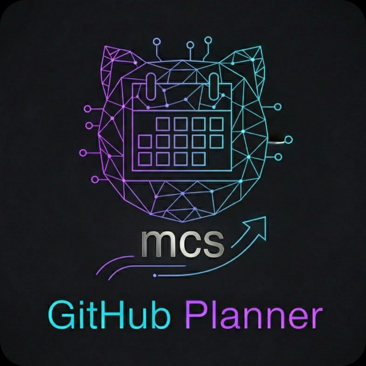

<div align="center">

<picture>
  
</picture>

### Your GitHub Project — planned, tracked, and healthy.


[](https://mcs-cli.dev)
[](https://cli.github.com)
[](LICENSE)
</div>

## 🔥 The Problem

I'm a software engineer who became an Engineering Manager. That shift can take you to an unfamiliar and uncomfortable place.

As a developer, the loop is clear: pick an issue, implement it, move the card on the board, get a code review, merge — **done and next task**.

As a manager, you handle that same loop **across an entire team** — multiplied by people, priorities, and **politics** (!).

You lose your focus time and your success metrics become intangible. This [transition is one of the hardest in tech](https://stackoverflow.blog/2022/02/23/what-you-give-up-when-moving-into-engineering-management/) where [nearly 60% of tech employees experience imposter syndrome](https://www.allstacks.com/blog/overcome-imposter-syndrome-software-engineering), hitting hardest when you're [leading engineers who are deeper technical experts than you](https://peterszasz.com/managing-impostor-syndrome-as-a-new-engineering-manager/).

As [Camille Fournier](https://www.linkedin.com/in/camille-fournier-9011812/) writes in [The Manager's Path](https://www.oreilly.com/library/view/the-managers-path/9781491973882/), each leadership step requires **letting go of what made you successful before** (but ["Old Habits Die Hard"](https://open.spotify.com/track/2v5f1poqSuqkNzHOQD4Ej7)) — and [64% of engineers who leave](https://jellyfish.co/blog/manager-to-engineer-ratio/) had managers stretched too thin to support them.

The operational overhead — tracking delivery, triaging backlogs, balancing workloads, spotting stale work — eats the time you should spend better.

- **Planning docs sit idle** — tasks never become trackable issues
- **Backlogs rot silently** — stale issues, mismatched priorities, no one triages
- **No delivery visibility** — "are we on track?" requires manual spreadsheet work
- **Team health is invisible** — overloaded developers aren't flagged until burnout
- **Decisions live in Slack** — no structured record, no searchable knowledge base
- **CI failures block quietly** — broken workflows pile up unnoticed

What if you had a swiss-knife tool to handle that side?

## ✨ The Solution

With the advent of [Claude Code](https://claude.com/product/claude-code), my good friend [Bruno Guidolim](https://github.com/bguidolim) created an amazing tool to help solve (in part) one of the biggest problems with agentic Engineering: **context rot** versus **effective context engineering** — the challenge of keeping AI agents grounded in the right information without losing coherence across long sessions.

While [Karpathy's AutoResearch](https://github.com/karpathy/autoresearch) proves what needs to be done for agents to work effectively long-term, MCS solves the problem of how to distribute it on Claude Code.
I invite you to try [MCS](https://mcs-cli.dev).

**GitHub Planner** is an MCS techpack built on top of that foundation — it turns planning documents into a fully managed GitHub workflow (all through Claude Code slash commands).

Issues, epics, triage, discussions, delivery metrics, CI health, and team workload analysis.

#### Quick Reference

```
/plan-preview plan.md                    # Preview issues (dry run)
/plan-issues plan.md                     # Create issues from a planning doc
/plan-epic plan.md                       # Create a project board from a doc
/plan-epic --link-only #1 #2 #3          # Link existing issues to a project
/issue-triage                            # Backlog health check + PM insights
/plan-discussion                         # Create a Discussion (interactive)
/plan-discussion --type decision         # Quick decision RFC
/plan-discussion --type analysis         # Evaluate anything (SDK, tool, vendor)
/plan-insights                           # Project delivery dashboard
/plan-insights --scope burndown          # Milestone burndown only
/plan-insights --scope timeline          # ASCII Gantt timeline
/plan-insights --scope ci                # CI/CD health + blocked PRs
/dev360-insights                         # Team workload overview
/dev360-insights --dev @username         # Individual health report
```

---

## 🚀 Install

### Prerequisites

- [MCS](https://mcs-cli.dev/) — Managed Claude Stack CLI, required to install and manage techpacks
- [GitHub CLI](https://cli.github.com/) (`gh`) — authenticated with `repo` and `project` scopes
- [jq](https://jqlang.github.io/jq/) — used by the session hook

GitHub CLI and jq are installed automatically via Homebrew if missing. MCS must be installed first.

### Setup

```bash
mcs pack add anettodev/github-planner
mcs sync
mcs doctor    # verify everything
```

During setup you'll be prompted for:

| Prompt | Description | Default |
|---|---|---|
| `GITHUB_REPO` | Target repository (`owner/repo`) | Current repo |
| `LABEL_PREFIX` | Prefix for auto-created labels | _(none)_ |
| `DEFAULT_ASSIGNEE` | Default issue assignee | _(none)_ |
| `STALE_THRESHOLD` | Days before an issue is flagged as stale | `14` |


---

## 📋 Commands

### `/plan-preview <path>` — Preview issues (dry run)

```
/plan-preview path/to/plan.md
```

Shows every issue that would be created — title, labels, milestone, risk, body preview — without touching GitHub. Flags problems in your document (vague tasks, oversized checklists, missing file paths).

### `/plan-issues <path>` — Create issues

```
/plan-issues path/to/plan.md
```

Parses the document, presents the full plan for approval, then creates:
1. **Labels** — auto-created with a standard color scheme if they don't exist
2. **Milestones** — one per phase or priority group
3. **Issues** — created in execution order with dependency references

| Flag | Description |
|---|---|
| `--repo owner/repo` | Override target repository |
| `--dry-run` | Same as `/plan-preview` |

### `/plan-epic <path>` — Create project board

```
/plan-epic path/to/plan.md
```

Creates a GitHub Project (v2) from a planning document with custom fields:
- **Priority**: Critical, High, Medium, Low
- **Phase**: Extracted from document sections
- **Status**: Backlog, Todo, In Progress, In Review, Done

Links all issues to the project and sets field values. Creates missing issues automatically.

| Flag | Description |
|---|---|
| `--repo owner/repo` | Override target repository |
| `--link-only #1 #2 #3` | Link existing issues to a project (no document needed) |
| `--project-number N` | Link to an existing project instead of creating new |

### `/issue-triage` — Backlog triage and health check

```
/issue-triage
```

Scans all open issues and produces a PM-level triage report:

- **Backlog composition** — bugs vs features vs refactoring, with decision tips
- **Priority re-evaluation** — flags mismatches (low-priority crashes, stale high-priority items)
- **UX impact assessment** — scores issues by user-facing impact, suggests UX health sprints
- **Staleness detection** — flags issues with no activity (30/60/120+ days)
- **Duplicate detection** — groups similar issues by title and labels
- **Oversized issues** — flags items with 8+ checklist items, suggests splits
- **Epic suggestions** — identifies natural groupings for project boards
- **Project health dashboard** — composition, age distribution, assignment coverage, UX score
- **Recommended actions** — prioritized list of what the PM should do next

Read-only by default. Use `--apply` to interactively approve and execute actions:

| Action | What it does |
|---|---|
| Apply labels | Adds missing or suggested labels |
| Change priority | Swaps priority labels based on re-evaluation |
| Close | Closes stale or duplicate issues with a comment + thumbs-down reaction |
| Defer | Moves issues to a later milestone, adds `deferred` label |
| Validate | Marks triaged issues with a `triaged` label + thumbs-up reaction |
| Split | Creates focused issues from oversized ones |
| Create epic | Groups related issues into a project board |

Every action requires individual confirmation — nothing is batch-applied.

| Flag | Description |
|---|---|
| `--repo owner/repo` | Override target repository |
| `--apply` | Enable interactive mode to apply suggestions |
| `--scope labels,priorities,...` | Limit analysis to specific categories |
| `--since 30d` | Only analyze issues updated in the last N days |

### `/plan-discussion` — Create structured discussions

```
/plan-discussion
/plan-discussion path/to/doc.md
/plan-discussion --type decision
```

Creates a GitHub Discussion from user input or a document. Supports 6 types:

| Type | Slug | Use case |
|---|---|---|
| Decision (RFC) | `decision` | Choose between approaches, get team input |
| Design Proposal | `design` | Propose architecture or technical approach |
| Sprint Retro | `retro` | End-of-sprint/phase reflection |
| Post-mortem | `postmortem` | Incident analysis and lessons learned |
| Distribution Analysis | `distribution` | Analyze any channel (App Store, Google Play, web, etc.) |
| Evaluation / Analysis | `analysis` | Evaluate an SDK, tool, vendor, platform, or process |

**Interactive mode** (no path): the agent interviews you with targeted questions for the selected type.

**Document mode** (with path): parses the document and restructures it into the right template.

Maintains a **Knowledge Manifest** at `docs/github-planner/KNOWLEDGE.md` — a version-controlled index of discussions created by this command, organized by type. Older entries are automatically archived to `docs/github-planner/archive/` when the file exceeds 20 KB to keep it scannable.

| Flag | Description |
|---|---|
| `--repo owner/repo` | Override target repository |
| `--type TYPE` | Skip type selection (decision, design, retro, postmortem, distribution, analysis) |

> **Note**: Requires GitHub Discussions to be enabled in the repo. If disabled, the command will detect it and guide you to enable it (Settings > General > Features). All other commands work without Discussions enabled.

### `/plan-insights` — Project delivery metrics

```
/plan-insights
/plan-insights --scope burndown
/plan-insights --scope timeline
```

Analyzes milestones, issues, and PRs to produce a project delivery dashboard:

- **Milestone burndown** — progress bar, sparkline velocity trend, and colored status indicators
  ```
  Progress  ████████░░░░░░░░░░░░ 36%   🟢 ON TRACK
  Velocity  ▂▄▅▇▅▃  2.5/wk            🟡 DECLINING
  ```
- **Delivery pipeline** — issues tracked through 8 stages (Backlog → Assigned → In Progress → In Review → Changes Requested → Approved → Merged → Done)
- **Stale work detection** — flags issues and PRs idle longer than the configured threshold (default: 14 days), with 🟡 warning / 🟠 stale / 🔴 critical severity
- **ASCII timeline** — Gantt-style view of milestones and issues with progress bars and critical path detection
  ```
  Phase 1 — Foundation
    Auth refactor    ████████                          ✅ Done
    API migration         ▓▓▓▓░░░░                    🟡 In Review
    DB schema                  ··░░░░░                 📋 Blocked
                                      ◆ Phase 1 due
  ```
- **CI/CD health** — workflow success rates, flaky test detection, blocked PRs, and deploy frequency (DORA)
  ```
  | Workflow | Runs | Success | Avg Duration | Trend    | Status       |
  |----------|------|---------|--------------|----------|--------------|
  | CI Tests | 48   | 92%     | 4m 12s       | ▅▇▅▃▁▃  | 🟡 DEGRADED  |
  | Deploy   | 12   | 100%    | 2m 05s       | ▇▇▇▇▇▇  | 🟢 HEALTHY   |
  ```
- **Project health summary** — color-coded dashboard combining burndown trajectory, pipeline flow, CI reliability, and stale ratio

Read-only — never modifies issues or milestones.

| Flag | Description |
|---|---|
| `--repo owner/repo` | Override target repository |
| `--scope burndown\|pipeline\|stale\|timeline\|ci\|health` | Show only one section |
| `--milestone NAME` | Focus on a specific milestone |
| `--period 30d` | Time window for velocity/trend calculations |

### `/dev360-insights` — Developer workload and health

```
/dev360-insights
/dev360-insights --dev @username
```

Analyzes developer activity for **workload balance and sustainability** — not productivity surveillance.

**Team overview** (default): workload distribution table + team health signals (balance, review culture, sustainability, knowledge sharing, bus factor).

**Individual report** (`--dev @username`): activity summary, weekly consistency pattern, contribution patterns (PR size, merge time, review turnaround), current workload, blocked/stale items, and health recommendations.

Workload classification: LIGHT / BALANCED / HIGH / OVERLOADED based on open issues and PR activity.

Health signals: consistency trends, weekend work flags, declining activity detection.

Read-only — never modifies issues, PRs, or assignments. No leaderboards, no ranking, no productivity scores.

| Flag | Description |
|---|---|
| `--repo owner/repo` | Override target repository |
| `--dev @username` | Individual developer report |
| `--period 30d` | Time window (default: 30 days) |

---

## ⚙️ How It Works

```
 Planning Doc        Claude Code       GitHub
 (markdown)   -----> (commands)  -----> (Issues, Projects, Discussions)
                         |
                    .-----------.
                    |           |
                    v           v
               Analysis     Actions
              (read-only)  (with --apply)
```

### Task extraction

Each phase, priority item, or numbered task becomes a GitHub Issue. Sub-steps become checklists. Dependencies between phases become issue cross-references.

### Label mapping

| Document signal | Label |
|---|---|
| "Delete", "Remove", "Clean up" | `cleanup` |
| "Refactor", "Reorganize", "Move" | `refactor` |
| "Fix", "Bug", "Broken" | `bug` |
| "Add", "Create", "Implement" | `enhancement` |
| "CRITICAL", "Priority 1" | `priority: critical` |
| "HIGH", "Priority 2" | `priority: high` |
| "MEDIUM", "Priority 3-4" | `priority: medium` |
| "LOW", "Priority 5-6" | `priority: low` |
| Architecture, patterns | `architecture` |
| Config, build, CI/CD | `infrastructure` |
| Breaking changes | `breaking-change` |
| Tests | `testing` |
| Docs | `documentation` |

### Severity scale

Used consistently across all reports:

| Indicator | Meaning |
|---|---|
| 🟢 | Healthy / On track |
| 🟡 | Warning / At risk |
| 🟠 | Stale / Degraded |
| 🔴 | Critical / Behind |

### Supported document types

- Refactoring plans (phased, prioritized)
- Migration plans
- Epic documents with stories/tasks
- Architecture decision records (ADRs)
- Sprint planning documents
- Technical debt inventories
- Any structured markdown with tasks, phases, or action items

---

## 🔁 Typical Workflow

```
/plan-preview plan.md          # 1. Review what would be created
/plan-issues plan.md           # 2. Create the issues
/plan-epic plan.md             # 3. Organize into a project board
/issue-triage                  # 4. Periodic backlog health check
/plan-discussion               # 5. Document decisions, run retros, evaluate deps
/plan-insights                 # 6. Track delivery progress and health
/dev360-insights               # 7. Review team workload balance
```

---

## 📦 What's Included

```
github-planner/
  agents/
    github-planner.md              # Creates issues via gh CLI
    github-project-manager.md      # Creates/configures GitHub Projects v2
    issue-analyst.md               # Analyzes issues for triage (read-only)
    discussion-manager.md          # Creates Discussions, maintains Knowledge Manifest
    plan-insights-analyst.md       # Analyzes delivery metrics (read-only)
    dev360-analyst.md              # Analyzes developer workload/health (read-only)
  commands/
    plan-issues.md                 # /plan-issues command
    plan-preview.md                # /plan-preview command
    plan-epic.md                   # /plan-epic command
    issue-triage.md                # /issue-triage command
    plan-discussion.md             # /plan-discussion command
    plan-insights.md               # /plan-insights command
    dev360-insights.md             # /dev360-insights command
  skills/
    plan-to-issues/                # Task extraction and label mapping
    epic-to-project/               # Project structure and custom fields
    issue-triage/                  # Triage rules and PM dashboard
    discussion-builder/            # Discussion types, interview logic, 6 templates
    plan-insights/                 # Delivery metrics and health scoring
    dev360-insights/               # Workload balance and team health
  templates/
    instructions.md                # CLAUDE.local.md instructions
  hooks/
    gh-auth-check.sh               # Session hook — verifies gh auth on start
    gh-auth-check-doctor.sh        # Doctor check script
  config/settings.json             # Permission allowlist for gh commands
  techpack.yaml                    # Pack manifest
```

---

## 🤝 Contributing

Contributions are welcome! See [CONTRIBUTING.md](.github/CONTRIBUTING.md) for guidelines.

We use a **fork-based workflow** — fork the repo, create a feature branch, and submit a PR.

---

<div align="center">

**MIT License** · Made with ❤️ by [anettodev](https://github.com/anettodev)

</div>
